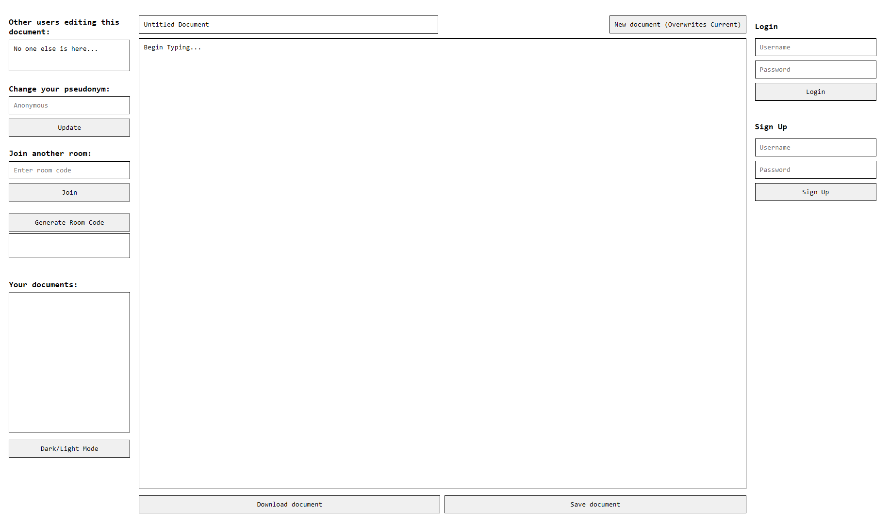

# Real-Time Collaborative Document Editor

This is a real-time collaborative document editor that enables multiple users to edit documents simultaneously. It includes features such as user login, signup, document creation, saving, and sharing via room codes. The backend uses **Node.js** and **SQLite**, and the client is served using **Snowpack**.

---

## Features

- Real-time collaboration using **Socket.IO**.
- User authentication with **bcrypt** for password hashing.
- Room-based document editing with unique room codes.
- Document saving and loading with persistence using **SQLite**.
- Dark/Light mode support.

---

### Document Editor Interface



---
## Installation

Follow these steps to set up and run the project on your machine.

### Prerequisites

Make sure you have the following installed:
- **Node.js** (v14 or higher)
- **npm** (Node Package Manager)

---

### 1. Clone the Repository

```bash
git clone https://github.com/yourusername/real-time-doc-editor.git
cd real-time-doc-editor
```

---

### 2. Install Dependencies

#### Server Setup

Navigate to the `server` directory and install dependencies:

```bash
cd server
npm install
```

#### Client Setup

Navigate to the `client` directory and install dependencies:

```bash
cd client
npm install
```

---

## Running the Application

### 1. Start the Server

To start the server (backend), run:

```bash
npm run devstart
```

The server will run on **`http://localhost:3000`**.

---

### 2. Start the Client

To start the client (frontend), run:

```bash
npm start
```

The frontend will be available at **`http://localhost:8080`**.

Snowpack handles the frontend module bundling and development environment.

---

## Project Structure

```
real-time-doc-editor/
│
├── server/             # Backend code
│   ├── server.js       # Main Node.js server with Socket.IO
│   ├── database.db     # SQLite database
│   └── package.json    # Server dependencies and scripts
│
├── client/             # Frontend code
│   ├── styles/         # CSS styles for Light/Dark mode, Main HTML file
│   ├── src/            # JavaScript modules (socket handling, state management, DOM interaction etc.)
│   ├── package.json    # Client dependencies and scripts
│   └── snowpack.config.js  # Snowpack configuration
│
└── README.md           # Project documentation
```
